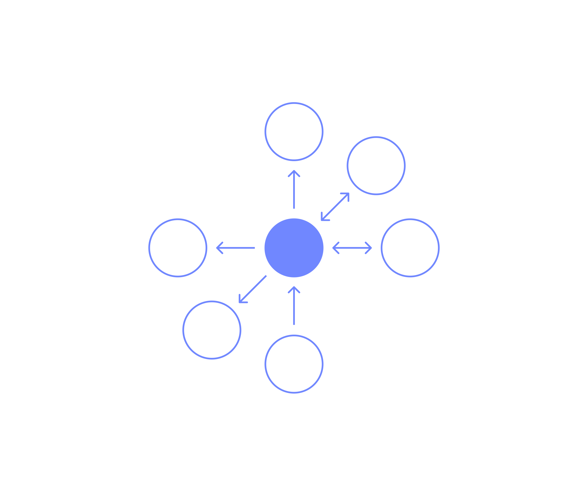

**Alle er vi opptatt av å finne måter å bli mer effektive på, oppnå mer og
fortsette skape noe verdifult. I vår streben etter effektivitet og innovasjon
kan digitale tjenesteplattformer spille en sentral rolle.  La oss dykke inn
i det!**

**Digitale tjenesteplattformer** eller _kjernesystemer_ er skreddersydde
digitale produkter bygget rundt sentrale data for et emne eller virksomhet.
Målet er som regel å gjøre data tilgjengelig samt bygge et fundament for
koblinger til og mellom andre systemer – både internt og eksternt.

Digitale tjenesteplattformer er egentlig ikke noe nytt. De fleste mellomstore
bedrifter og oppover har i mer eller mindre grad etablert noe som ligner på en
digital tjenesteplattform. Begrepet fagsystem har over tid vært mer brukt for å
forklare det, spesielt i en tid hvor programmene ble laget som store sammensatte
enkeltprogrammer (monolitter).

Jeg tror at når det er blitt mer normalt å sy sammen systemene har begrepet
digital tjenesteplattform fått større betydning, dette fordi vi trenger å
etablere et felles sted hvor dataene lagres. Fellestrekket er at det er systemer
som er laget for å ivareta funksjoner og data felles for et fagfelt eller det vi
kaller et domene.

Taksering Norge har utviklet en digital tjenesteplattform. I løsningen ligger
oppdragene, og det er i dette systemet takstene lages. Bookingen av befaringer
gjøres i et annet system, og kundestøtte gjøres i et annet. Intensjonen er at
alle systemene skal være koblet sammen, og at de skal kunne utveksle data med
hverandre, og det gjør de med utgangspunkt i den digitale tjenesteplattformen.

## Fordelene med en digital tjenesteplattform

Jeg skal starte med en antagelse; For å få nødvendig gjennomslagskraft kan man
ikke kjøpe kjernesystem som man krangler om å gjøre bedre eller mer tilpasset
egne behov – man må lage eget. For å fortsette å skape verdi må vi kunne endre
oss, og det er spesielt derfor jeg tror det er viktig at man starter å lage en
digital tjenesteplattform så tidlig som mulig.

Det finnes gode produkter der ute som løser vanlige problem nesten alle
virksomheter har. Kalender, kundekontakt, chatteprogram, osv. En digital
tjenesteplattform gjør at vi kan nyte godene av å ha et skreddersydd system
samtidig som vi kan ta i bruk de beste arbeidsverktøyene som er tilgjengelige på
markedet. Vi kan bytte ut slike verktøy uten å tape vesentlig data siden den
ligger trygt i tjenesteplattformen, og ikke minst eksperimenterer med nye ting.

## Bruksområder

Om vi tar utgangspunkt i en eiendomsforvalter, så kan en digital
tjenesteplattform være stedet man lagrer informasjon om eiendommene,
vedlikeholdsplaner og kontrakter. Allikevel er det kanskje et forvaltningssystem
hvor eiendommene og vedlikeholdet styres og kontrakter legges inn. Selv om alle
i selskapet jobber daglig i det ene forvaltningssystemet, så trenger det ikke å
være den primære kilden til all data. Om vi ser for oss at man i fremtiden har
lyst til å bytte ut forvaltningssystemet, kan man potensielt jobbe i begge
systemer parallelt, men en felles digital tjenesteplattform.

Med flere forvaltningssystemer, som begge har to-veis integrasjoner, skaper det
muligheter på flere måter. Et annet eksempel er kanskje et regnskapsbyrå, som i
første omgang trenger å ha oversikt over oppdrag og oppgaver for å sørge for god
kvalitetssikring. En digital tjenesteplattform, eller kjernesystem, vil i det
eksempelet kanskje ta hånd om kundene og hva slags oppgaver de skal gjøre. Selve
utføringen av oppgavene er kanskje satt til et oppgavehåndteringssystem, og
_kundebilde_ gjøres kanskje i et kundehåndteringssystem.

## Hvordan implementere det?

Jeg tror vi bør være litt pragmatiske. En digital tjenesteplattform er ikke et
veldig spesifikt produkt, og mitt perspektiv er at det kun sier noe om
intensjonen og ikke hvordan. Med andre ord, så ville jeg anbefalt om man ikke
kjenner sitt behov å starte med noe enkelt, slik som å kun ha en database,
kanskje et oppsett basert på [Sanity][] eller kanskje noe som [Airtable][].

I en bedrift med større behov, som kanskje har eller vil få flere tjenester som
trenger kjernedataen, så vil det være naturlig å ha et API av noe slag. Da blir
det viktigere å avklare regler for hvordan vi henter dataen, med tilgangsstyring
og det hele.

[sanity]: https://www.sanity.io/
[airtable]: https://airtable.com/

## Oppsummert

Digitale tjenesteplattformer er en nøkkelkomponent i moderne
virksomhetsstrategier. Dette handler først og fremst om den visjonære
tilnærmingen en bedrift har til hvordan data og systemer skal utnyttes for å få
mest mulig effekt og verdi. Med konseptet digitale tjenesteplattformer kan vi ta
i bruk nye digitale produkter og teknologier tidligere, senke terskelen for
innovasjon og skape nye muligheter for samarbeid og verdiskapning.

[Rådgiverne i Bjerk][kontakt] kan hjelpe deg med å sette i gang med å skape en
digital tjenesteplattform. Bruk oss gjerne for å finne ut av hva du trenger,
hvilken strategi du skal ha for å implementere det, eller om det gir mening for
deg å gjøre det.

[kontakt]: /kontakt
