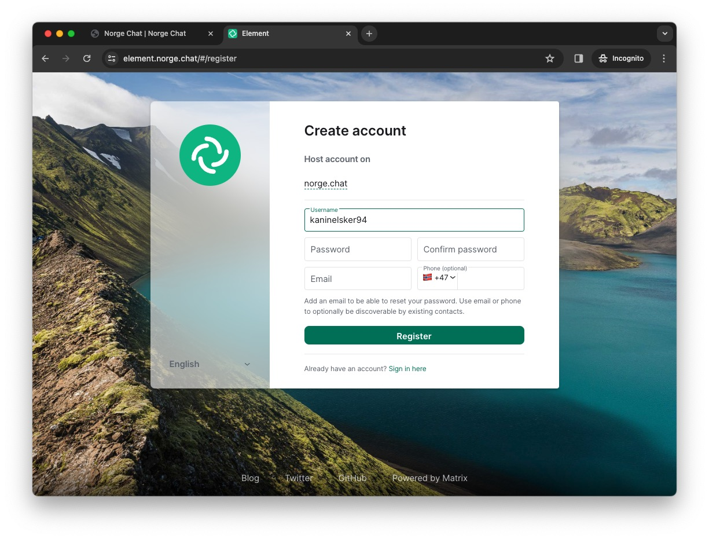

---
title:
  'Alle burde ta i bruk fødererte sosiale medier. Det er enklere enn du tror!'
description: 'De siste årene har vi for alvor begynt å ta et oppgjør med lukkede, proprietære
plattformer og se tilbake til grunnpillarene for internettet. Det er mulig å få
moderne funksjonalitet og brukervennliget samtidig som personvern er ivaretatt
og man ikke låses til én plattform.'
socialMediaDescription: 'Det er på tide å ta tilbake internettet fra de fire-fem store plattformene som
bruker alle triksene i boken for å holde seg selv på toppen og høste størst
mulig gevinst for sine investorer på bekostning av frihet.'
date: 2023-11-22T14:00:00
image: ./network.jpg
author:
  - brage-sekse-aarset
---

**Alle burde ta i bruk fødererte sosiale medier. Det er enklere enn du tror!**

I disse tider er det mange som bekymrer seg over sosiale mediers
påvirkningskraft, både som vanedannende distraksjoner, kommersielle monolitter
og som persondatainnhøstere. Dette er ikke uten grunn.

[cory-foredrag]: https://youtu.be/rimtaSgGz_4?si=rzJPn9Pn1yYcQE2u

Det er på tide å ta tilbake internettet fra de fire-fem store plattformene som
bruker alle triksene i boken for å holde seg selv på toppen og høste størst
mulig gevinst for sine investorer på bekostning av individuell frihet. Hvis du
selv er i tvil om dette, hør forfatter og aktivist Cory Doctorow sitt foredrag
[An Audacious Plan to Halt the Internet’s Enshittification](cory-foredrag).

Dagens sosiale medieplattformer har bygget opp inngjerdede økosystemer som
sperrer deg helt ute hvis du ikke har en konto der. Må det være slik? Mange
kloke hoder har utviklet løsninger for å motvirke monopolisering av
kommunikasjonsteknologi og sikre interoperabilitet, altså at forskjellige
systemer er kompatible og kan snakke med hverandre. Det var faktisk slik
internettet oppsto i utgangspunktet!

De siste årene har vi for alvor begynt å ta et oppgjør med lukkede, proprietære
plattformer og se tilbake til grunnpillarene for internettet. Det er mulig å ha
moderne funksjonalitet og brukervennliget samtidig som personvern er ivaretatt
og man ikke låses til én plattform.

## Enter the Matrix

[Matrix](https://matrix.org/about/) er en åpen prokotoll for desentralisert og
sikker kommunikasjon. Matrix kan brukes til mange forskjellige ting, men i all
hovedsak brukes det til direktemeldinger og gruppesamtaler i samme gate som
Messenger, WhatsApp, Telegram, Signal, osv. Matrix støtter bl.a. ende til
ende-kryptering, mediefiler, meldingsreaksjoner og videosamtaler og det kommer
stadig nye forbedringer.

Matrix er bygget på åpen kildekode og bidrag fra felleskapet, og forvaltes av en
ideell stiftelse. Siden Matrix i seg selv er en protokoll finnes det flere
tjenere og klienter som "snakker Matrix" man kan velge mellom.

En stor fordel med dette kontra kommersielle og monolittiske tjenester er at
hvis du er misfornøyd med brukergrensesnittet kan du bytte til en annen klient
som passer dine behov eller bidra til å forbedre den du allerede bruker. Dataen
din ligger på tjeneren og forsvinner ikke dersom du bytter klient.

<!--
Matrix støtter noe som kalles "spaces", som ligner på Discord-tjenere eller
Slack-tjenere og lar deg organisere et større felleskap som består av flere
samtalerom. Teknologien er moden for å bytte ut Discord og Slack om man bare tør
og det vil bare bli bedre og bedre med tiden, og hvis du er misfornøyd med
grensesnittet er det tross alt ikke verre enn å bytte til en annen klient, bidra
til å forbedre den eller lage din egen.
-->

## Hvordan kommer jeg i gang?

Det første man må gjøre når man skal ta i bruk Matrix er det samme man må gjøre
når man skal ta i bruk epost. Man må velge hvor man skal lage en konto.

Matrix.org har en
[liste over offentlig tilgjengelige matrix-tjenere](https://servers.joinmatrix.org/)
som er et godt sted å starte, men hvis du bare vil komme i gang vil jeg tipse om
den norske [norge.chat](https://norge.chat/), som drives av noen ildsjeler som
på sikt ønsker å drive tjenesten gjennom en ideell organisasjon.

<!--
Selv har jeg Matrix-konto gjennom hacklab.fi som er paraplyorganisasjonen hvor
[mitt lokale hackerspace](https://xn--jyvskyl-7wae.hacklab.fi/) er medlem.
Bedrifter, foreninger og forbund er gode institusjoner for å drifte
Matrix-tjenere, da de har en naturlig interesse av å koble folk sammen.
-->

Innmelding er enkelt og rett frem. Når du har en konto kan du installere en
Matrix-klient på enhetene dine og logge inn. Den mest populære er nok
[Element](https://element.io/), men det er egentlig helt vilkårlig hvilken
klient du bruker, akkurat som med epostklienter som Mozilla Thunderbird og Apple
Mail.

## Ok, men jeg kjenner jo ingen som bruker Matrix?

Matrix er designet for å kunne kobles på andre kommunikasjonsplattformer. På
nettsiden deres kan du få hjelp til å sette opp såkalte
["bridges"](https://matrix.org/ecosystem/bridges), altså broer til andre
applikasjoner som Discord og Slack. Broene speiler alle meldinger på tvers av
tjenestene som om alle brukte samme kommunikasjonsplattform og fasiliterer en
myk overgang til (og evt. fra) Matrix.

Dessuten kan du jo prøve å invitere folk du kjenner til å bruke Matrix. Start en
gruppechat, inviter folk og se hvem som dukker opp? Hvem vet, kanskje kjenner du
allerede noen som er på Matrix?

Du kan også gjerne slenge meg en melding på @braaar:hacklab.fi. Jeg biter ikke.

## Lemmy?

Skal jeg skrive noe om lemmy?
