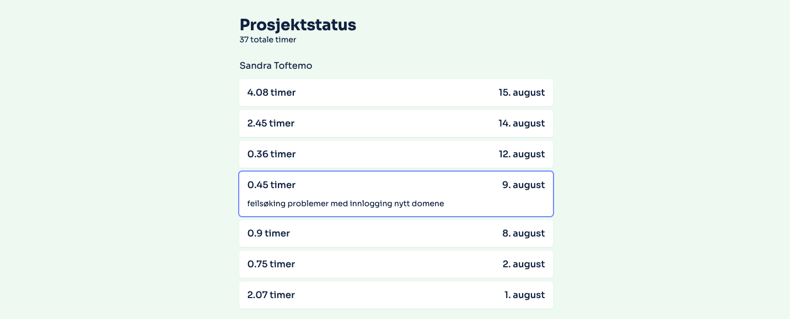

Tenk deg følgende scenario: Det er en inneklemt fredag i mai. Solen skinner, og
du kan høre lyden av kollegaer som snakker høyt om morsomme helgeplaner. Men i
stedet for å haste mot nærmeste uteservering, sitter du og en kollega og jobber
intensivt med et prosjekt som kan “revolusjonere bransjen”...igjen.

Dette var realiteten i Bjerk for litt over ett år siden. Vi revolusjonerte
kanskje ikke bransjen, men vi sitter igjen med et verktøy som skaper masse verdi
– både for oss og alle våre kunder. Dette verktøyet er Prosjektrapporten.

## Sannheten (om timeføring)

La oss være helt ærlige - timeføring er ikke den morsomste delen av
arbeidsdagen. Men vi har innsett at den ene tingen kunder virkelig setter pris
på, er transparens og ærlighet. Og hva er mer ærlig enn å gi dem direkte innsyn
i hvor mange timer vi faktisk bruker på prosjektene deres?

Prosjektrapporten vår er ikke noe banebrytende teknologisk underverk. Det er
rett og slett en live-oppdatert nettside som viser kundene våre nøyaktig hva vi
bruker tiden vår på. Timene, kommentarene, hvem som har gjort hva – alt ligger
der, åpent og ærlig.

Men her er poenget: Den løser et reelt problem. Kunder slipper å lure på hva
tiden vår går til. Vi slipper alle telefoner og e-poster med spørsmål om
timebruk. En inneklemt fredag ble til en løsning som sparer tid, bygger tillit
og gjør hverdagen enklere for alle involverte.

## Teknologi som et middel, ikke mål

Prosjektrapporten er mer enn bare et verktøy – den er et eksempel på et av våre
prinsipper. Teknologi er ikke målet i seg selv, men et middel for å løse reelle
utfordringer. Vi kunne ha brukt måneder på å utvikle en kompleks, funksjonsrik
plattform. I stedet tok vi ett skritt tilbake og spurte: Hva er det egentlige
behovet her?

Dette er kjernen i hvordan vi i Bjerk tilnærmer oss problemløsning. For vi er
ikke bare utviklere - vi er problemløsere.

Tenk på det "ene problemet" som dukker opp igjen og igjen. Det som får deg til å
sukke hver gang det blir tatt opp i et møte. Hva om det kunne løses med en
skreddersydd, men enkel teknisk løsning?

I Bjerk går vi alltid gjennom en prosess som har noen enkle formål. Det vi
ønsker å oppnå er å:

1. Avdekke de reelle behovene bak problemet
2. Klekke ut innovative idéer
3. Raskt skape prototyper og teste løsningene
4. Validere om løsningen faktisk løser problemet

Og det beste? Man trenger ikke nødvendigvis å investere i en langvarig, kostbar
utviklingsprosess for å finne ut om det fungerer.

## Når tillit blir mer enn bare et buzzord

Tilbake til Prosjektrapporten. Ved å gi kundene våre full innsikt, sier vi i
praksis: "Her er alt vi gjør. Bedøm oss gjerne." Er det skummelt? Litt. Er det
risikabelt? Kanskje. Er det verdt det? Absolutt.

For i en hverdag full av komplekse utfordringer, viser det seg at noen av de
beste løsningene kan være overraskende enkle. Som å vise folk hva du faktisk
bruker tiden din på. Eller å ta det "umulige" problemet ditt og bryte det ned
til noe håndterbart.

Prosjektrapporten ble ikke laget for at vi skulle tjene noe på det. Og skal vi
være helt ærlige, så ble den kanskje delvis laget fordi vi var lei av å svare på
spørsmålet "Hva har dere egentlig brukt tiden på?". Men som en uventet bonus har
den vist seg å være gull verdt når det gjelder å bygge tillit og styrke
kundeforholdene våre.

Det viser seg at når du gir folk innsyn i det du gjør, stoler de mer på deg.

## Din tur til å tenke enkelt og smart

Prosjektrapporten er ikke perfekt. Den løser ikke alle problemer i verden. Men
det er et skritt i retning av en mer åpen og ærlig måte å drive business på. Og
hvem vet - kanskje kan den inspirere andre til å tenke på hvordan de kan bruke
teknologi til å bygge sterkere relasjoner, ikke bare større fortjeneste.

Så neste gang du står overfor et tilsynelatende uløselig problem, spør deg selv:
Kunne en enkel teknisk løsning være svaret? Kanskje trenger du ikke en
omfattende digital transformasjon. Kanskje det du trenger er en partner som kan
hjelpe deg å ikke se skogen for bare trær.

For i Bjerk tror vi på kraften i smarte løsninger. Vi tror på å bruke teknologi
for å løse reelle problemer, ikke bare for teknologiens skyld. Og vi er klare
til å hjelpe deg med å gjøre det samme.

Hvem vet? Kanskje ditt neste store gjennombrudd bare er en inneklemt fredag
unna.
