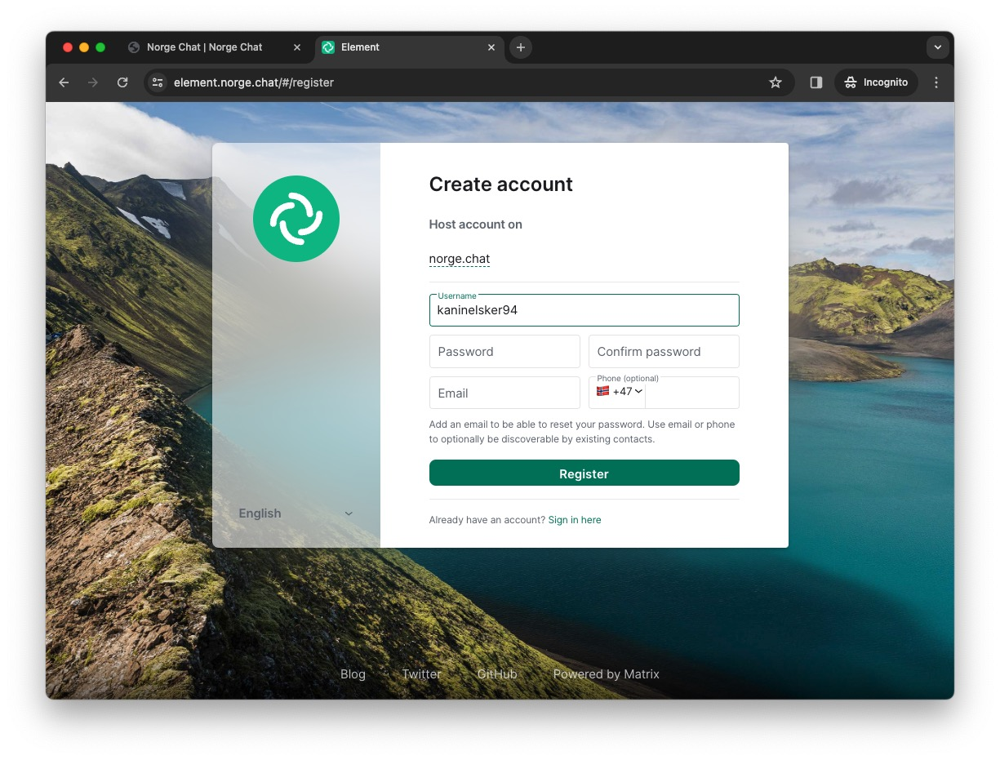

I disse tider er det mange som bekymrer seg over sosiale mediers
påvirkningskraft, både som vanedannende distraksjoner, kommersielle monolitter
og ikke minst som persondatainnhøstere. Hvis du er interessert i å høre noen
sterke ord på temaet vil jeg sterkt anbefale forfatter og aktivist Cory Doctorow
sitt foredrag
[An Audacious Plan to Halt the Internet’s Enshittification](https://youtu.be/rimtaSgGz_4?si=rzJPn9Pn1yYcQE2u).

Dagens sosiale medieplattformer har bygget opp inngjerdede økosystemer som ikke
snakker med andre systemer og gjør alt de kan for å holde fast på deg og ditt
vennenettverk. Men det må faktisk ikke være slik. Mange kloke hoder har utviklet
smarte løsninger for å motvirke monopolisering av kommunikasjonsteknologi og
sikre interoperabilitet, altså at forskjellige systemer er kompatible og kan
snakke med hverandre. Det var faktisk slik internettet oppsto i utgangspunktet,
så dette har man lang tradisjon for.

De siste årene har vi for alvor begynt å ta et oppgjør med lukkede, proprietære
plattformer og se tilbake til grunnpillarene for internettet. Det er mulig å ha
moderne funksjonalitet og brukervennliget samtidig som personvern er ivaretatt
og man ikke låses til én plattform.

## Enter the Matrix

[Matrix](https://matrix.org/about/) er en åpen prokotoll for desentralisert og
sikker kommunikasjon. Det fungerer altså veldig likt som epost, slik at man
registrerer seg hos én Matrix-tjener og kan kommunisere i øst og vest til
brukere som er registrert hos andre Matrix-tjenere. Matrix er dog mye mer egnet
til hyppig og direkte kommunikasjon i samme gate som Messenger, WhatsApp,
Telegram, Signal, osv. Matrix støtter bl.a. ende til ende-kryptering, emojier,
mediefiler, meldingsreaksjoner og videosamtaler og det kommer stadig nye
forbedringer.

Matrix er bygget på åpen kildekode og bidrag fra felleskapet, og forvaltes av en
ideell stiftelse. Siden Matrix i seg selv er en protokoll finnes det flere
tjenere og klienter som "snakker Matrix" man kan velge mellom.

En stor fordel med dette kontra lukkede tjenester er at du står fritt til å
velge hvor du vil registrere din konto og hvilket grensesnitt du ønsker å bruke.
Det spiller heller ingen rolle hvor kontaktene dine har Matrix-konto, akkurat
som med epost.

## Hvordan kommer jeg i gang?

Det første man må gjøre når man skal ta i bruk Matrix er det samme man må gjøre
når man skal ta i bruk epost. Man må velge hvor man skal lage en konto.

Matrix.org har en
[liste over offentlig tilgjengelige matrix-tjenere](https://servers.joinmatrix.org/)
som er et godt sted å starte, men jeg vil tipse om den norske
[norge.chat](https://norge.chat/), som drives av noen ildsjeler som på sikt
ønsker å drive tjenesten gjennom en ideell organisasjon.

Selv har jeg Matrix-konto gjennom hacklab.fi, som er paraplyorganisasjonen hvor
[mitt lokale hackerspace](https://xn--jyvskyl-7wae.hacklab.fi/) er medlem.
Bedrifter, foreninger og forbund er gode institusjoner for å drifte
Matrix-tjenere, da de har en naturlig interesse av å koble folk sammen. Kanskje
er arbeidsplassen din interessert i å sette opp en egen Matrix-tjener og
potensielt bytte ut Slack, Telegram eller Discord?

Innmelding er enkelt og rett frem. Når du har en konto kan du installere en
Matrix-klient på enhetene dine og logge inn. Den mest populære er nok
[Element](https://element.io/), men det er egentlig helt vilkårlig hvilken
klient du bruker, akkurat som med epostklienter som Mozilla Thunderbird og Apple
Mail.d

## Ok, men jeg kjenner jo ingen som bruker Matrix?

Det vil nok ta litt tid før "alle" bruker Matrix, men heldigvis er det er
designet for å kunne kobles til andre kommunikasjonsplattformer for å gjøre
overgangen lettere. På nettsiden deres kan du få hjelp til å sette opp såkalte
["bridges"](https://matrix.org/ecosystem/bridges), altså broer til andre
applikasjoner som Discord og Slack.

Broer sender meldinger på tvers av tjenestene som om alle i chatten brukte samme
kommunikasjonsplattform og fasiliterer da en myk overgang til (og evt. fra)
Matrix. I hackerspacet mitt har vi broer til Discord, Telegram, IRC og WhatsApp,
så det skal ikke være noe problem for hvem som helst å delta i samtalen!

Dessuten kan du jo invitere folk du kjenner til å bruke Matrix. Start en
gruppechat, inviter folk du kjenner og se hvem som dukker opp? Hvem vet, kanskje
kjenner du allerede noen som bruker Matrix?

Du kan også gjerne slenge meg en melding på
[@braaar:hacklab.fi](https://matrix.to/#/@braaar:hacklab.fi).
