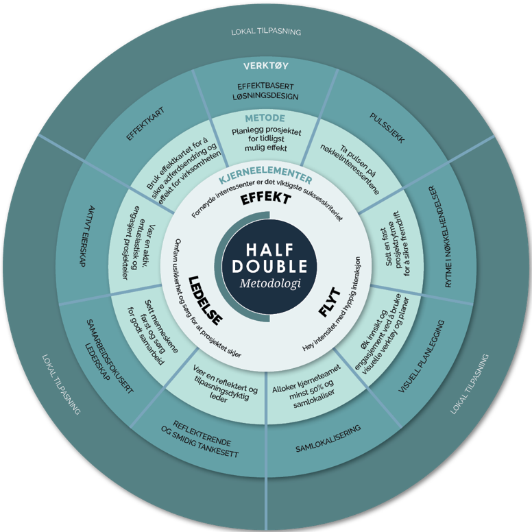
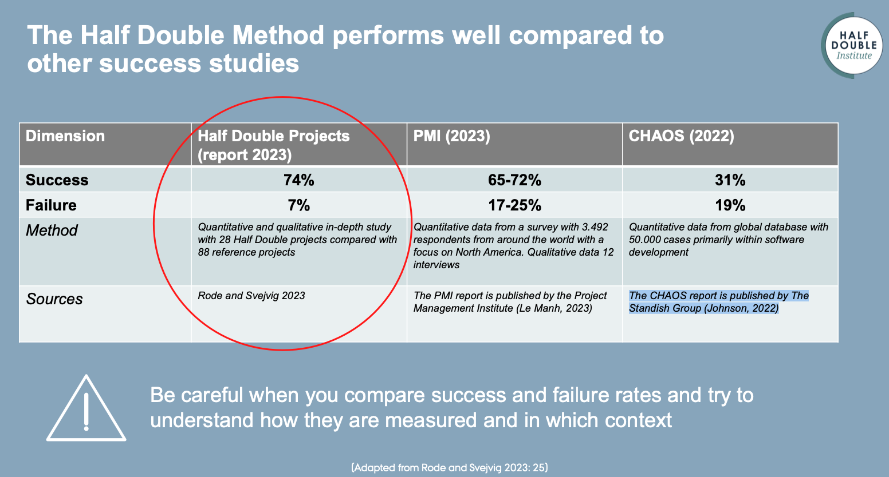

**Ifølge The Standish Groups “CHAOS rapport” (Johnson, 2022) basert på 50.000
prosjekter, hadde kun 31% av prosjektene de analyserte lykkes i måloppnåelsen.
Det betyr at investerte verdier tapes på grunn av dårlig prosjekt
gjennomføring.**

Jeg har gjennom hele min karriere jobbet med prosjekter i IT, Telekom og
Humanitær sektor og har dessverre den samme erfaringen – **prosjektene oppnår i
altfor liten grad ønsket effekt.** Og det til tross for at vi hadde innarbeidet
prosjektmetodikk, definerte styringsgrupper og nitidig rapporteringsrutiner. Og
alt kan ikke produktorganiseres heller. Noen endringer er rett og slett for
store eller komplekse, eller involverer for mange interessenter.

## Hva er utfordringen med tradisjonell prosjektledelse?

Tradisjonell prosjektledelse har ofte satt hovedfokus for et vellykket prosjekt
på leveranse, det vil si å fullføre et prosjekt innenfor gitte tidsrammer og
budsjett. Det krever svært god planlegging før prosjektoppstart og det er en god
tilnærming når alt er kjent og få, om noen, endringer er nødvendig underveis i
prosjektet.

Videre skal prosjektet levere et produkt eller en tjeneste, men uten
oppmerksomhet på om produktet eller tjenesten faktisk gir de ønskede resultatene
og fordelene. Gevinstrealisering gjennomføres etter at prosjektet er ferdig.

Prosjektene skal altså strengt tatt ikke forholde seg til ny kunnskap, ny
teknologi, nye behov, endrede vilkår eller andre endringer underveis. Da blir
det evnt endringsmeldinger, også ofte kalt scopecreep. **Og effekten – ja den må
andre ta seg av...**

## Hva gjorde man i Danmark med «prosjektproblemet»?

Det er nå 10 år siden erfarne prosjektutøvere på ulike nivåer i Danmark ble
samlet for å diskutere forbedringsmuligheter for prosjektledelse, i lys av høy
feilfrekvens i prosjekter. Deltakerne hadde en bred bakgrunn innen produksjon,
finans, forsikring, informasjonsteknologi, offentlig forvaltning,
ledelsesrådgivning, universiteter og Dansk Industri.

Erfaringer og teknikkene som ble diskutert var gode, men var en blanding av
prinsipper, metoder, konkrete verktøy og generelle erfaringer. Det var vanskelig
å kommunisere og implementere systematisk. Derfor ønsket Dansk Industrifond å
utvikle og konseptualisere teknikkene til en metode, og finansierte derfor
Project Half Double. **Formålet med Project Half Double er å forbedre dansk
industriell konkurranseevne ved radikalt å øke tempoet og effekten av
utviklings- og innovasjonsaktivitetene som gjennomføres innenfor rammen av
prosjektene.**

## Hva er Half Double?

Det overordnede målet er å levere 'prosjekter på halve tiden med dobbel effekt',
der prosjekter på halve tiden skal forstås som halvparten av tiden til
påvirkning (gevinstrealisering, effekt oppnås) og ikke som halvparten av tiden
for prosjektgjennomføring.

**Half Double-metodikken er en hybrid prosjektmetodikk som tar det som
erfaringsvis gir mest verdi fra tradisjonell prosjektmetodikk og kombinerer
dette med hensiktsmessige verktøy og metoder fra smidig utvikling. Det er en
innovativ tilnærming til prosjektledelse som fokuserer på å maksimere effekt og
minimere sløsing i prosjekter.**

Half Double-metodikken innlemmer Lean-prinsipper og Agile-elementer for å oppnå
målene. Dette innebærer at prosjektene bør være resultatorienterte, ha kortere
beslutningssykluser, og være åpne for endringer basert på tilbakemeldinger og
nye innsikter.

Metodikken baserer seg på tre sentrale prinsipper:

1. **EFFEKT:** Half Double-metodikken begynner med å tydelig definere
   prosjektets mål og ønskede effekter. Dette sikrer at prosjektet har en klar
   forbindelse til organisasjonens strategiske mål. Målene skal være spesifikke,
   målbare og relevante for å sikre at prosjektet bidrar til verdiskapning.
1. **FLYT:** Metodikken fremmer fleksibilitet i gjennomføringen av prosjekter.
   Team oppfordres til å tilpasse seg endringer raskt og kontinuerlig forbedre
   arbeidsprosessen. Dette bidrar til å minimere tid brukt på ikke-verdiskapende
   aktiviteter og maksimere produktiviteten.
1. **LEDELSE:** Half Double-metodikken legger stor vekt på kontinuerlig læring
   og forbedring. Gjennom retrospekter og jevnlig evaluering av prosjektet
   oppfordres teamene til å identifisere hva som har fungert godt, hva som kan
   forbedres, og hvordan man kan bruke denne kunnskapen til å øke effekten i
   fremtidige prosjekter.

## Forskning viser at det fungerer!

Universitetet i Århus har forsket på over 100 prosjekter i 23 organisasjoner og
hatt dialog med ytterligere 300 organisasjoner i 8 år for å se om Half Double
gjør en reell forskjell. Det er ikke bare spørreundersøkelser, men dybde
forskning både kvalitativt og kvantitativt.

Prosjektene er fra små, mellomstore og store organisasjoner på tvers av sektorer
og bransjer. De varierer i kompleksitet, skala og størrelse, inkludert små,
mellomstore og store prosjekter – koster opptil 650 millioner DKK og involverer
nesten 350 000 timer.

Resultatet er oppløftene. **74% av prosjektene når alle eller de fleste av sine
suksesskriterier med høy grad av måloppnåelse.** Kun 7% mislykkes.

Hele rapporten finner du her:
[Rode and Svejvig (2023) Project Half Double Evaluation of Phase 3.pdf (halfdoubleinstitute.org)](https://halfdoubleinstitute.org/sites/default/files/2023-06/Rode%20and%20Svejvig%20%282023%29%20Project%20Half%20Double%20Evaluation%20of%20Phase%203.pdf)

## Kan små og mellomstore bedrifter (SMB) utnytte potensialet i Half Double-metodikken?

134 små og mellomstore bedrifter har brukt Half Double-metodikken og 10 Half
Double prosjekter i SMB-segmentet har blitt evaluert i dybden og sammenlignet
med 58 SMB referanseprosjekter og viser en suksessrate på 90% og en feilrate på
0%. Dette er enda bedre resultat enn på tvers av sektorer. **Det indikerer at
SMB har mulig enda bedre resultater når man benytter Half Double.**

---

### Våre erfaringer i House of Agile

Vi i House of Agile har brukt Half Double siden 2018 og opplever at metoden kan
tilpasses til lokale forhold i de fleste organisasjoner. **Half Double er
spesielt relevant for prosjekter med høy grad av usikkerhet.** Gjerne tekniske
utviklingsprosjekter, hvor endringer og usikkerhet er vanlige.

**Ved å fokusere på verdiskapning, fleksibilitet og læring, kan Half
Double-metodikken hjelpe prosjekteiere, prosjektledere og teamene deres med å
oppnå ønsket effekt i utviklingsprosjekter på en mer effektiv måte.**

**Ta gjerne kontakt dersom du er nysgjerrig på Half Double eller [House of
Agile][hoa].**

[hoa]: https://www.house-of-agile.no/
