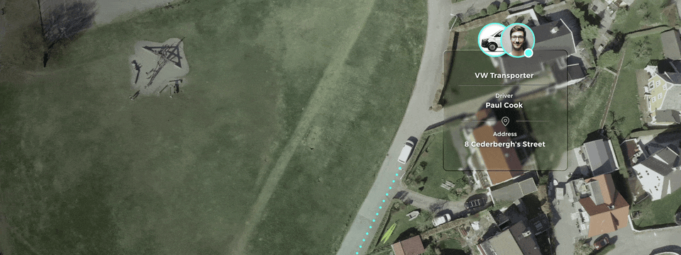

Procore is committed to advancing the construction industry by improving the
lives of construction workers, driving technology innovation, and building a
global community of groundbreakers. They build a global construction platform
that unites all stakeholders on a project with unlimited access to support and a
business model designed for the construction industry.

ABAX enables business insight and value from connected mobility data by
translating customer needs into advanced technology solutions. They help people
manage and monitor their vehicles and equipment and have become one of the
largest telematics companies in Europe.

On behalf of Procore and ABAX, we have created a synchronization between the two
systems taking telemetry from equipment and adding it to project reports, making
it easier and accessible and, in the end, easier to make environmentally sound
decisions.

One of the goals of this project was to explore ways Procore and ABAX, both
delivering value in the construction industry, could combine their effort to
improve the lives of their customers.

This matched very well with how Bjerk operates – we are making people's lives
better by improving how we communicate, learn and, in this case, work. We are
happy to work on this project with Bjørn Brustad fra ABAX, Tony Harbour and
Andrew Hemry from Procore. On our end, Brage Sekse Aarset is our lead, along
with Thomas Brustad working as a product developer.

In this first rendition, the core value of the integration is automating data
entry for asset usage. Data collected by ABAX IoT devices installed on machinery
and tools will be synchronized to Procore's reporting tool. By doing so, we
provide data to project managers and other stakeholders so they can track,
protect and monitor valuable assets and gain insight into performance metrics
which helps to optimise the use. Ultimately, these are ways to make things more
environmentally friendly with ease!

The plan for the future is to build out the integration after learning how users
use the integration and what their needs are and experiment.

We thank ABAX for bringing us along on this project 🙌