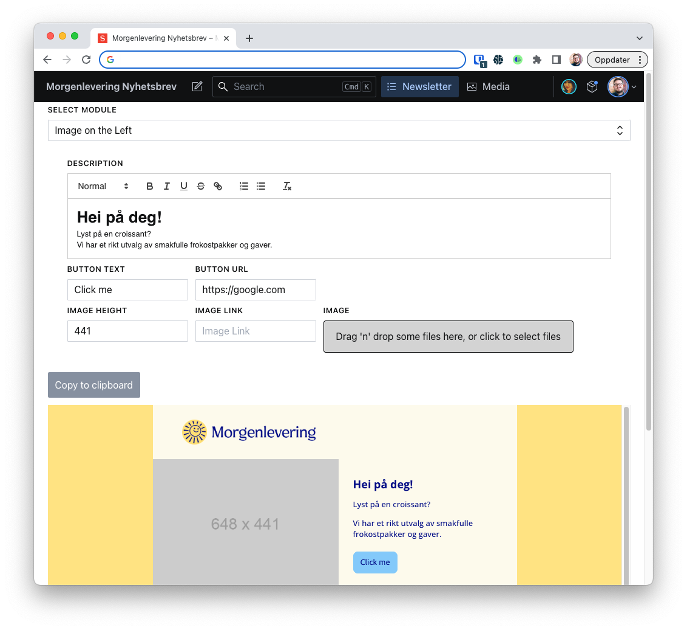

Morgenlevering har som mål å gjøre dagen lysere, det gjør de gjennom å levere
frokost-opplevelser rett hjem til deg. I første kvartal 2023 lanserte
Morgenlevering en nytt visuell profil, og sammen med ny profil ønsket de å
forsterke identiteten deres på nyhetsbrevene.

Bjerk har sammen [Grid branding](https://grid.no) utviklet et eget designverktøy
for nyhetsbrev, som ikke bare fremhever identiteten deres, men gjør det også
enklere for de ansatte i Morgenlevering å komme med selskapets budskap!

Et av de mest populære kanalene Morgenlevering har er nyhetsbrev, og som kunde
av Morgenlevering siden 2021 står det «Side 1 av mange» når man søker i
innboksen.

**Det skal være enkelt å bruke** er et premiss vi i Bjerk er bestemte på, men
verktøyet Morgenlevering brukte (Intercom) hadde store begrensninger for hvordan
ting kunne utformes. Det som tok oss videre var idéen om å lage noe som
fristilte Morgenlevering til å velge alle slags systemer for å lage nyhetsbrev –
ikke at vi investerte mye tid for å få Intercom til å fungere.

Vi snudde oss derfor mot å lage et designverktøy, hvor elementene i
nyhetsbrevene skulle redigeres.

Vi innså underveis i prosessen at om vi skulle bygge et eget verktøy ville
bilder være noe vi måtte levere utenfor Intercom, da vi ikke kunne koble oss på
for å laste det opp noe sted der.

Morgenlevering brukte allerede Sanity i kombinasjon med at det nylig var lansert
versjon 3, som gjorde at utvikling av programtillegg ble like enkelt som å
skrive vanlige React-komponenter. Bjerk har også brukt Sanity til egne ting og
bygget allslags til og rundt Sanity, så det ble etterhvert et åpenbart valg.
