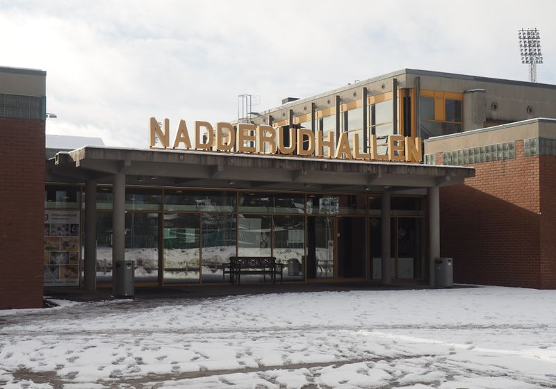
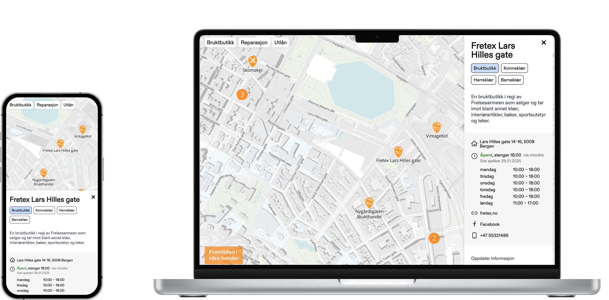

# **Gjenbruksportalen - Bærekraftig teknologi for Framtiden i Våre Hender**

Framtiden i våre hender (FIVH) er en av Norges største miljø- og solidaritetsorganisasjoner med over 50.000 medlemmer. Organisasjonen ble stiftet under et folkemøte i Nadderudhallen, Bekkestua i 1974 etter initiativ fra Erik Dammann, og har siden da vært en viktig stemme for etisk og bærekraftig forbruk i Norge.

Gjennom årene har FIVH jobbet målrettet med klima, naturvern, gjenbruk og rettferdig handel. Med en kombinasjon av kampanjer, politisk arbeid og folkelig engasjement har de skapt positive endringer, blant annet innen tekstilindustrien og gjenbrukskultur i Norge.
  

 
*Nadderudhallen - hvor FIVH ble stiftet 25 april 1974. *Foto: [MortenHV](https://lokalhistoriewiki.no/wiki/Bruker:MortenHV) / [CC BY-SA 3.0](https://creativecommons.org/licenses/by-sa/3.0/)**
  

## **Utfordringen**

I de første kalenderdagene av 2025 kom FIVHs lokallag i Bergen til oss med en tydelig utfordring. De ville gjøre det lettere å gjenbruke, reparere og låne fremfor å forbruke  og samtidig øke bevisstheten rundt arbeidet sitt. 

Løsningen ble Gjenbruksportalen. En portal som samler informasjon om lokale aktører innen gjenbruk, utlån og reparasjon i Bergen.

## **Vår tilnærming**

Fra første stund hadde vi tydelige rammer for hva som var mulig. Med et begrenset budsjett (støttemidler fra [LNU](http://lnu.no)) måtte vi kunne levere verdi raskt. Samtidig ville vi etablere et konsept som kunne utvides i funksjonalitet og geografisk omfang på sikt.

I tråd med frivillighetens typiske rammer samlet vi oss etter arbeidstid for å gjennomføre en rekke øvelser. Målet med møtet var å forstå; *hva* vi skulle lage, *hvorfor* vi skulle lage det, og *hvem* vi skulle lage det for. 

Vi jobbet oss grundig gjennom målsettinger, målgrupper, prioriteringer, funksjonskrav og risikohåndtering. Prosessen ledet oss til noen sentrale krav til løsningen:

* Løsningen måtte være kostnadseffektiv og enkel å vedlikeholde  
* Teknologivalg måtte baseres på realistiske forutsetninger – budsjett, ambisjoner og tilgjengelige ressurser  
* Plattformen måtte være tilrettelagt for framtidig utvikling og skalering  
* Produktet skulle reflektere FIVHs kjerneverdier og personlighet
  
> "Samarbeidet med Bjerk har vært smidig, effektivt og en hyggelig opplevelse. Brage og Carl Oscar har strukket seg langt for å imøtekomme våre behov, både til arbeidstider, frister, designvalg og økonomiske rammer. Samtidig har vi blitt godt veiledet og involvert i valgene som 
ble gjort i sanntid. Vi håper å kunne ta opp igjen samarbeidet i nær framtid!\"
 
*\- Ørjan Olsen Furnes, Prosjektleder og Styremedlem FIVH Bergen*
 

## **Løsningen**

Gjenbruksportalen gir brukerne et interaktivt kart som viser veien til gjenbruksbutikker, utlånssteder og reparasjonsverksteder i Bergen. Disse er geografiske datapunkteneKartet er hjertet i løsningen, og her tok vi et valg som passet perfekt med både våre og FIVHs verdier – å lene oss på Open Street Map (OSM).

 OSM er en fellesskapsdrevet karttjeneste som er åpen og gratis for alle – enten du er privatperson, frivillig organisasjon eller kommersiell aktør. Kartdata fra OSM brukes i en rekke applikasjoner som Uber, Snapchat, Pokémon GO og Strava, men OSM inneholder også data om butikker og andre institusjoner. Med det fleksible taggesystemet i OSM kan man skildre bruktbutikker og andre bærekraftsorienterte ting. 

Det geniale med OSM i dette prosjektet er at det åpner for bred deltakelse og samspill mellom ulike løsninger. Som frivillig organisasjon har ikke FIVH kapasitet til å dedikere fulltidsressurser til å vedlikeholde datagrunnlaget for Gjenbruksportalen. Heldigvis kan hvem som helst bidra til OSM – både våre frivillige og brukere av andre løsninger som bygger på den samme åpne databasen. Dette betyr at Gjenbruksportalen ikke bare drar nytte av frivillig innsats, men også av kontinuerlige oppdateringer fra et bredere økosystem. Løsningene konkurrerer ikke om data, men tilbyr ulike skreddersydde grensesnitt basert på den samme felles datakilden.  

 
  

## **Tekniske valg**

Selve applikasjonen utviklet vi med Astro og React, sammen med et knippe utvalgte JavaScript-biblioteker som [maplibre](https://maplibre.org/) for tegning av kartet og nanostores for state management. Hele prosjektet har naturligvis åpen kildekode, slik at frivillige kan bidra med ny funksjonalitet eller oppdatere informasjon om lokale aktører. Automasjoner med Github Actions sørger for at man ikke trenger en dedikert DevOps-person for å kjøre ut oppdateringer.

## **Veien videre**

Gjenbruksportalen har funnet sin nisje, selv om den foreløpig ikke har de mest avanserte funksjonene. Med et prosjekt finansiert av støttemidler måtte vi prioritere hardt underveis. Nettopp derfor var det åpenbart riktig å lansere produktet som åpen kildekode – for å gi det muligheten til å vokse og forbedres over tid, både i funksjonalitet, brukeropplevelse og design.

Det viktigste er at portalen allerede i dag leverer på sitt hovedløfte. *Å gjøre det mer oversiktlig og enklere å ta bærekraftige forbrukervalg*.
  
> "Vi er veldig fornøyde med utseende, brukervennligheten og funksjonaliteten vi har fått på plass til tross for begrensede midler. Kartløsningen gir oss et solid fundament for testing gjennom bruk, og videreutvikling\."
 
*\- Ørjan Olsen Furnes, Prosjektleder og Styremedlem FIVH Bergen*
 

  
---

**Har du en idé som fortjener å bli realisert, eller en utfordring som trenger en smart løsning?**

Ta en prat med oss, så finner vi ut hvordan vi kan gjøre det mulig sammen!
