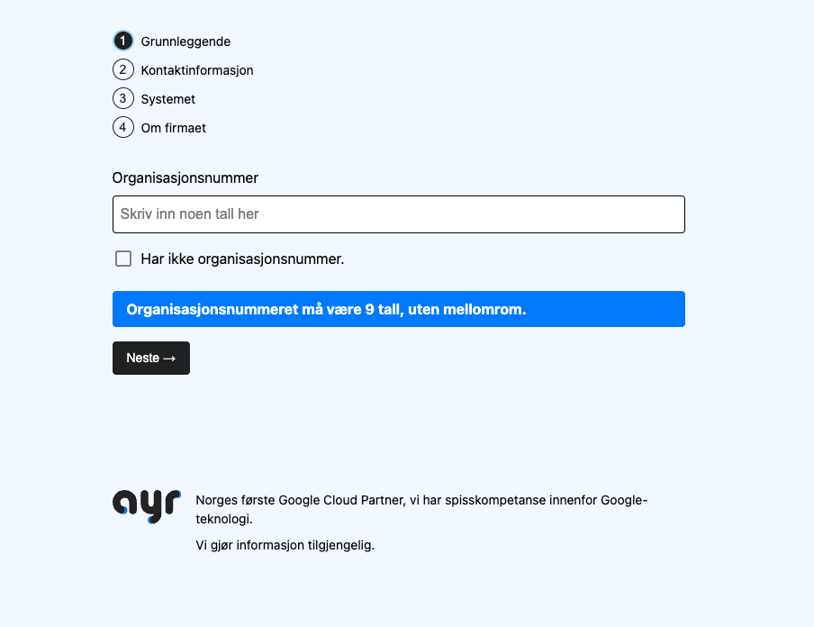

**Utfordringen:** Effektivisering av kunderegistrering

Ayr, Norges første Google Cloud Partner, sto overfor en klassisk utfordring:
Hvordan gjøre onboarding av nye kunder enkel og effektiv, både for kundene selv
og for interne ressurser? Med sin spisskompetanse innenfor Google-teknologi,
visste Ayr at svaret lå i skyen - men veien dit krevde en dose med like deler
teknisk innsikt og brukerforståelse.

## Bjerks tilnærming: Fra innsikt til innovasjon

Før vi skrev en eneste linje kode, gjennomførte vi dybdeintervjuer med Ayrs
salgsteam. En kritisk innsikt dukket opp: Tidsbruken på mindre kunder var ikke
lønnsom. Lavmargin-bestillinger ble ytterligere belastet av manuell
tilbudsproduksjon og tidkrevende oppfølging. Med denne kunnskapen begynte vi å
tenke utenfor boksen. Hvordan kunne vi gjøre små transaksjoner lønnsomme uten at
det gikk på kompromiss med kundeservice?

Vi tror på at teknologi skal forenkle, ikke komplisere. Vår tilnærming til Ayrs
utfordring var todelt: brukersentrert design og sømløs systemintegrasjon. Vi
startet med å dykke inn i kundens reise, fra første interesse til fullført
onboarding. Målet var å skape en prosess som var intuitiv og enkel.

Svaret lå i automatisering og selvbetjening, men utfordringen var å gjøre det på
en måte som fortsatt føltes personlig og verdifull for kunden. Vi utviklet ideen
om et selvbetjent onboardingskjema - et verktøy som kunne guide kunder gjennom
prosessen, samtidig som det samlet all nødvendig informasjon for Ayr.

## Løsningen: Et smart onboardingskjema

Resultatet av vårt samarbeid med Ayr er et onboardingskjema som er mer enn bare
et skjema - det er i praksis en check out og komplett kundereise.
Nøkkelfunksjonene inkluderer:

- Stegvis prosess som guider kunden fra grunnleggende info til spesifikke behov
- Sanntidsvalidering av informasjon i feltene for å redusere feil og
  frustrasjoner
- Direkte integrasjon med Ayrs CRM og ordresystemer, som eliminerer manuell
  dataoverføring
- Fleksibelt design som enkelt kan tilpasses Ayrs tjenestetilbud og ulike
  kundegrupper

Utviklingsprosessen var preget av tett samarbeid og kontinuerlig forbedring. Vi
gjennomførte regelmessige revisjoner, samarbeidet tett med Ayrs IT-team for
sømløs integrasjon, og involverte faktiske kunder i testingen for å sikre at
løsningen møtte reelle brukerbehov.

## Resultater og innsikt

Implementeringen av det nye onboardingskjemaet ga Ayr noen tydelige fordeler:

1. Rakere, enklere og mer tilpasset onboarding for nye kunder
2. Frigjøring av ressurser for Ayrs team til mer verdiskapende aktiviteter
3. Forbedret datakvalitet gjennom automatisert innsamling og validering

Dette prosjektet har ikke bare forbedret Ayrs onboardingprosess - det har
tydeliggjort noen essensielle innsikter hva gjelder kundeengasjement:

- Kunder forventer å kunne gjøre ting selv, på sin egen tid. Selvbetjening er
  noe alle kan bli bedre på å implementere der hvor de møter kundene sine
- Sømløs integrasjon mellom systemer er avgjørende for operasjonell effektivitet
- Brukervennlighet trumfer (ofte) funksjonalitet – intuitive systemer er
  nøkkelen til suksess
- Data er gull – riktig datainnsamling gir dypere innsikt i kundenes behov og
  atferd

For Ayr markerer denne onboarding en ny måte å kommunisere med sine kunder.

Og for oss i Bjerk? Det er nok en bekreftelse på at når vi kombinerer teknisk
kunnskap med genuin forståelse for menneskelige behov, kan vi skape løsninger
som fører til reell effekt og verdi – for alle.
