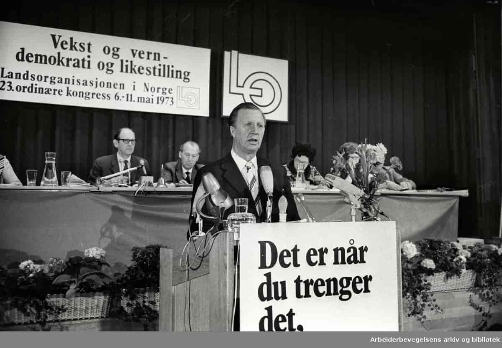
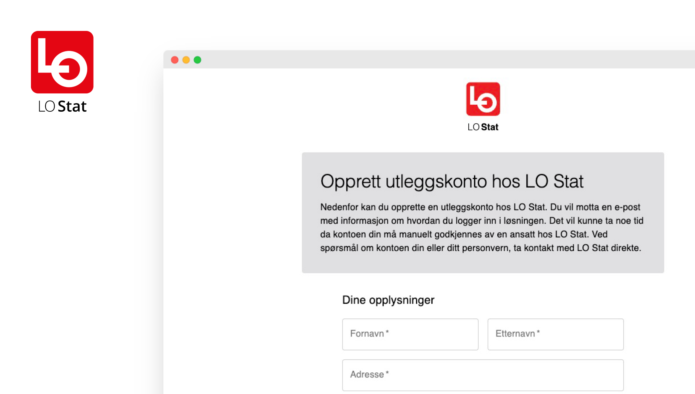

# Reiseregninger rett fra lomma

**Utfordringen:** Når papirarbeid står i veien for engasjement.

I hjertet av norsk arbeidsliv står LO som en sentral aktør, dedikert til å
støtte og engasjere sine medlemmer. Men selv de mest progressive organisasjoner
kan snuble over uventede hindringer. For LO Stat ble håndteringen av
reiseregninger en voksende hodepine som stjal verdifull tid fra deres egentlige
oppdrag.

Utfordringen var tydelig definert – medlemmer som strevde med tilganger og lite
brukervennlige prosesser for registrering av utlegg etter inspirerende møter og
konferanser. Ansatte som brukte uforholdsmessig mye tid på å manuelt behandle
utlegg i stedet for å fokusere på medlemsservice. En prosess som var ment å være
en enkel administrativ oppgave, hadde blitt en barriere for engasjement og
effektivitet.

LO Media leverer blant annet teknologi og digitale tjenester til de ulike
foreningene i LO. De innså tidlig at noe måtte gjøres for å støtte
organisasjonene rundt seg. De trengte å skape en løsning som ikke bare
effektiviserte prosessen, men som også gjenspeilet organisasjonens verdier om
inkludering og støtte. Det var her Bjerk kom inn i bildet.

## Vår tilnærming: Teknologi møter mennesker

Vi i Bjerk tror på at den beste teknologien er den du knapt merker at du bruker.
Vi startet oppdraget med å snakke med alle relevante interessenter for å skaffe
et tydelig bilde av hvordan dagens løsninger fungerte, og hvor skoen faktisk
klemte.

En kritisk innsikt dukket raskt opp: For mange medlemmer var reiseregninger en
sjelden forekomst. Hver innlevering ble dermed en ny læringskurve, en kilde til
frustrasjon snarere enn en enkel administrativ oppgave. Dette var ikke bare et
spørsmål om effektivitet, men om å fjerne barrierer for deltakelse i
organisasjonen.

Prosessen var preget av tett samarbeid og kontinuerlig forbedring. Vi brukte
elementer fra design thinking for å utfordre forutinntatte meninger om hvordan
løsningen burde se ut og fungere. Gjennom arbeidsmøter, itererte vi raskt og
tilpasset løsningen basert på reelle tilbakemeldinger.

## Resultatet: Enkel tilgang - for _alle_

Resultatet av vårt samarbeid med LO Media er en digital plattform som
fasiliterer for løpet fra utlegg til refusjon. Nøkkelfunksjonene inkluderer:

- Intuitivt brukergrensesnitt som guider medlemmer steg for steg gjennom
  prosessen
- Mulighet for å laste opp bilder av kvitteringer direkte fra mobilen
- Automatisk datavalidering for å redusere feil og frustrasjoner
- Sømløs integrasjon med Visma Expense, som eliminerer manuell dataoverføring
- Fleksibelt design som enkelt kan tilpasses ulike typer arrangementer og utlegg

På den tekniske fronten, valgte vi en moderne og fremtidsrettet stack (OBS!
tekniske detaljer for spesielt interesserte):

- Frontend: Next.js med Material UI for et responsivt og brukervennlig
  grensesnitt
- Backend: tRPC for effektiv og typesikker kommunikasjon mellom klient og server
- Integrasjon: Typical-fetch for robust kommunikasjon med Visma Expense API
- Infrastruktur: Pulumi for infrastruktur som kode (IaC), som sikrer konsistent
  og repeterbar utrulling

## Innsikt

Implementeringen av den nye plattformen ga LO Media noen håndfaste gevinster:

- Redusert tid for innlevering og behandling av reiseregninger
- Økt brukertilfredshet blant medlemmer, spesielt de som sjelden sender inn
  reiseregninger
- Frigjøring av administrative ressurser til mer verdiskapende aktiviteter
- Forbedret datakvalitet gjennom automatisert innsamling og validering

Det handler ikke bare om å digitalisere prosesser, men om å gi medlemmene
verktøy som faktisk gjør hverdagen enklere. Dette prosjektet har vist at selv de
minste endringene kan ha stor innvirkning. For hvert minutt spart på
administrasjon, er det et minutt mer til å utføre meningsfylt arbeid. Og i en
organisasjon som LO, hvor hvert medlem teller, kan disse minuttene summere seg
opp til reell, positiv endring i arbeidslivet.
